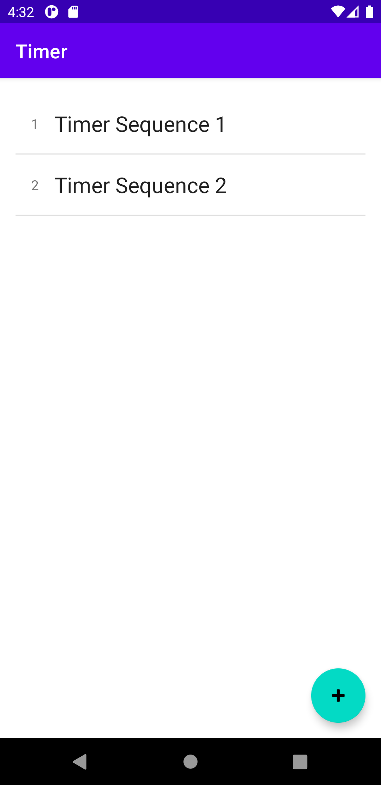
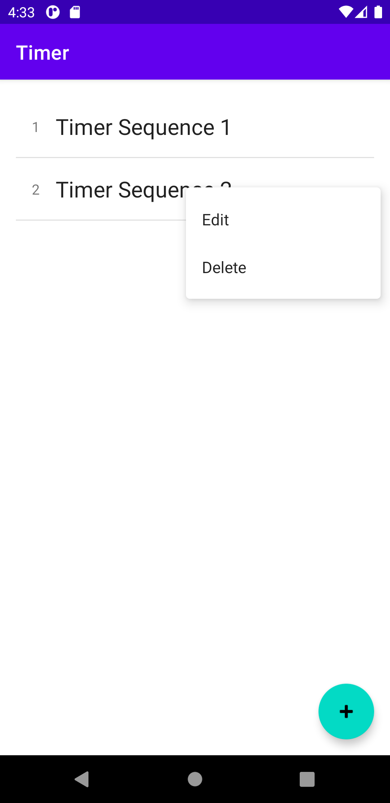
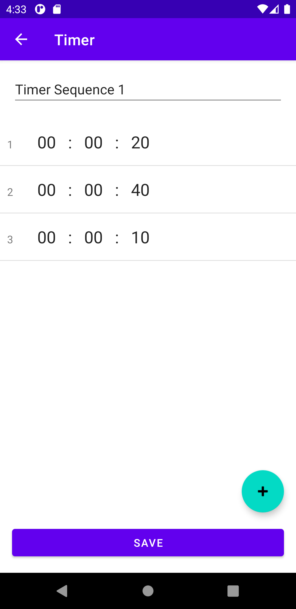
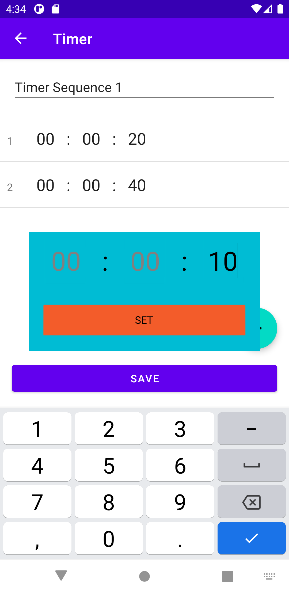
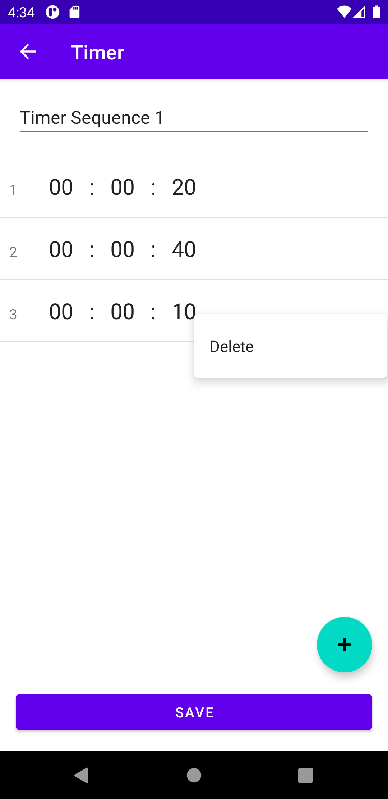
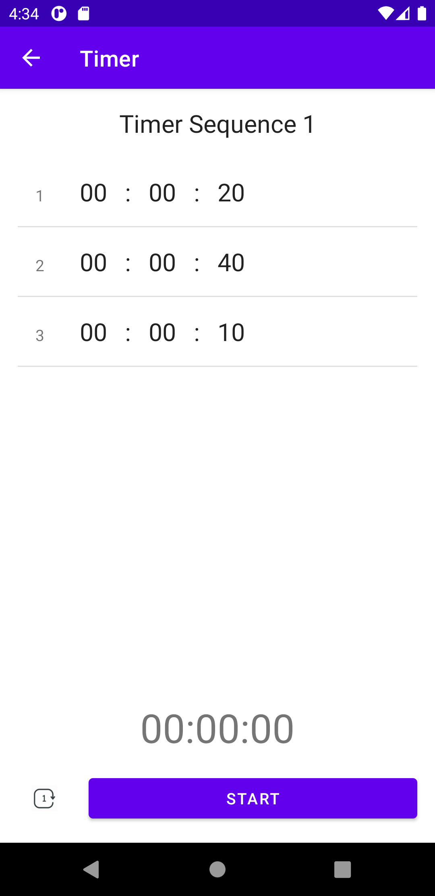
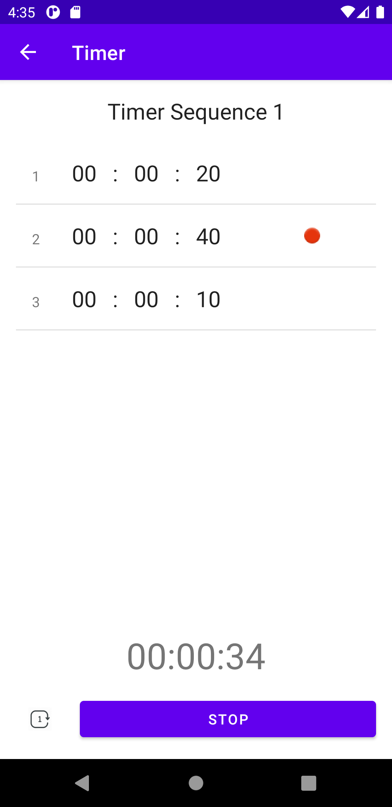

# Android Countdown Timer
This is a simple, no-frills but efficient timer app for android created based on my personal need.

You can create multiple sequences of countdown timers which can be run once or in a loop.

And the most important feature of this app - Unlike all other timers I have used, it doesn't
throw a tantrum at the end of the countdown. It just beeps twice to inform you and then promptly
shuts-up without you even needing to touch the phone.

### Screen 1: 
*The first screen lists all stored sequences called events*

- Create new events by clicking + button
- Long press each event to get Menu to either edit or delete event

- Press event to open screen to run the sequence
 
### Screen 2:

*This screen is used to create new event or edit existing event*

- Click + button to create new timer item

- Long press timer item to open Menu to get delete option

- Press timer item to edit existing timer
  
### Screen 3:
  
 *This screen is used to run created event*
 
 
  
- Press start to start timers items one after other in sequence
- After each timer item end there is a tone of 50ms is played twice with a gap of 50ms along with vibration
- The timer item which is active is marked with a red dot

- To stop timer at any time press stop. This resets the timer sequence which can be restarted again.
- To loop sequence repeatedly press repeat button beside start
